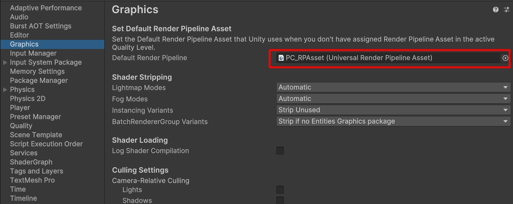
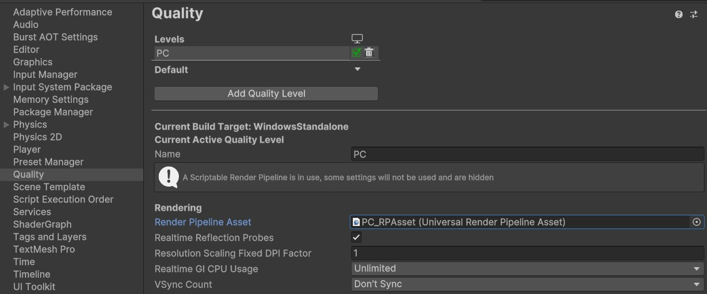
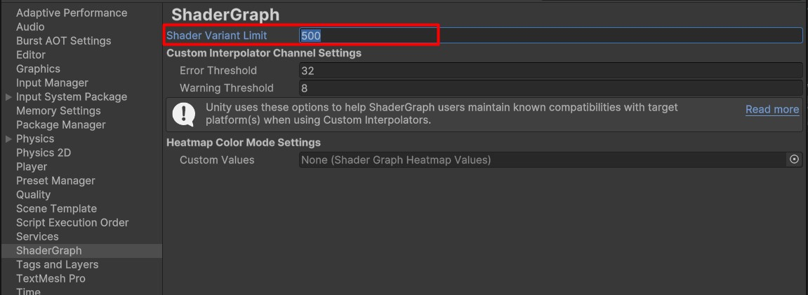
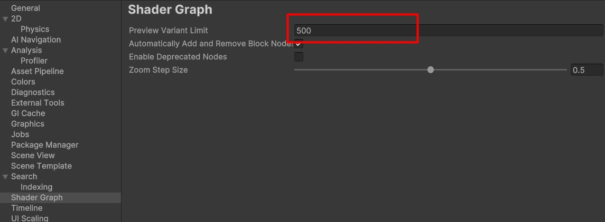
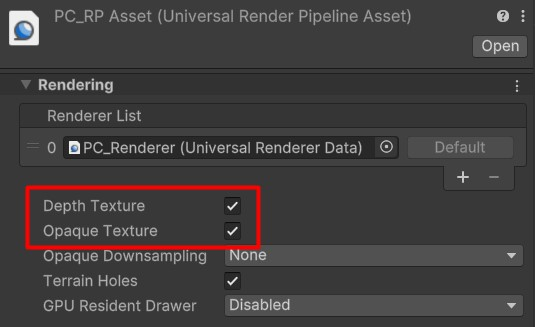

# Water Shader for Unity URP - Getting Started

---

## Recommended Unity Version

- **Unity Version**: 6000.0.30f (or later)
- **Renderer**: Universal Render Pipeline (URP) **only**
- **Shadergraph** 17.0.3 (or later)

---

## Prerequisites

### 1. Choose Your Workflow (Prebuilt Compiled vs. Source Shader Graph)

Depending on how you intend to use the water system, you can choose between the compiled shader or the source Shader Graph:

* **Prebuilt Compiled Shader (Recommended)**:  
  Use `Assets/Shaders/Uber Stylized Water/Shader/UberStylizedWater.shader`. Since this is a pre-compiled shader, it **does not require** tweaking any project shader variant limits.
* **Source Shader Graph (For customizing/modifying the shader)**:  
  Use `Assets/Shaders/Uber Stylized Water/Shader/Devlopment/UberStylizedWaterGraph.shadergraph`. To open and compile this graph, you **must** increase the shader variant limits as described below:

#### Adjusting Variant Limits in Project Settings:
- Open the **Project Settings** and ensure that the **Graphics** and **Quality** section is set to **Universal Render Pipeline Asset**
  
  
- On the **Shadergraph** section:
  - **In Unity 6.0**: increase the 'Shader variant limit' to 500.
  - **In Unity 6.1**: increase the 'Shader variant limit' to 25000.
  

#### Adjusting Preview Variant Limits in Preferences:
- On the **Preferences**, under the **ShaderGraph** section:
  - **In Unity 6.0**: increase the 'Preview variant limit' to 500.
  - **In Unity 6.1**: increase the 'Preview variant limit' to 25000.
  

## Import the asset

There are two ways to import the asset:

1. Download the reposetory as a zip file.

   - Copy the `Assets/Shaders/Uber Stylized Water/ folder` to your project.

2. Get the latest unity package from [release](https://github.com/MatrixRex/Uber-Stylized-Water/releases) page.

   - Import the package.

### Configure the URP Asset

Use the pre-configured Renderer Asset included in the `Demo/Settings` folder.

Or Modify your URP Renderer Asset to support the shader:

1. Open your Renderer Asset.
2. Check the **Depth Texture** option.
3. Check the **Opaque Texture** option.(Required for Refraction)

---

## Demo Scene

Get started quickly with the provided **Demo Scene**:

1. Open the `Uber Stylized Water/Demo/Uber Stylized Water.unity` scene.
2. Explore a fully set up environment featuring:
   - **8 Water Presets**
   - A complete **Planar Reflection Setup**

---

## Adding the Shader to Your Own Scene

There are three ways to use the shader in your custom scenes:

### 1. Use Template Prefabs

- Drag and drop water prefabs from the `Prefabs/Water Templates` folder into your scene.

### 2. Apply Preset Materials

- Select any water preset material from the `Uber Stylized Water/Template Materials` folder.
- Assign it to your existing meshes.

### 3. Create Your Own Material

- Create a new Material in Unity.
- Assign the water shader to your material:
  - Select `Uber Stylized Water` shader (uses the prebuilt compiled `UberStylizedWater.shader`).
  - Or, if you are customizing the graph, assign the shader generated from `UberStylizedWaterGraph.shadergraph` under the `Devlopment` folder.

---

## Next step

- Tweak the material properties in [Shader Properties](usage-guide/shader-properties/shader-properties.md)

## Additional Components

- [Planar Reflection Setup Guide](usage-guide/Additional-Components/planner-reflection-setup.md)

---
