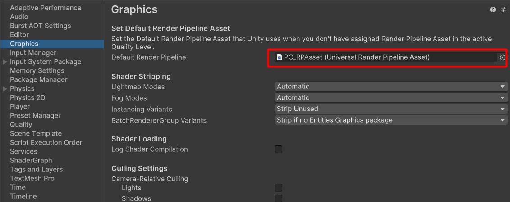
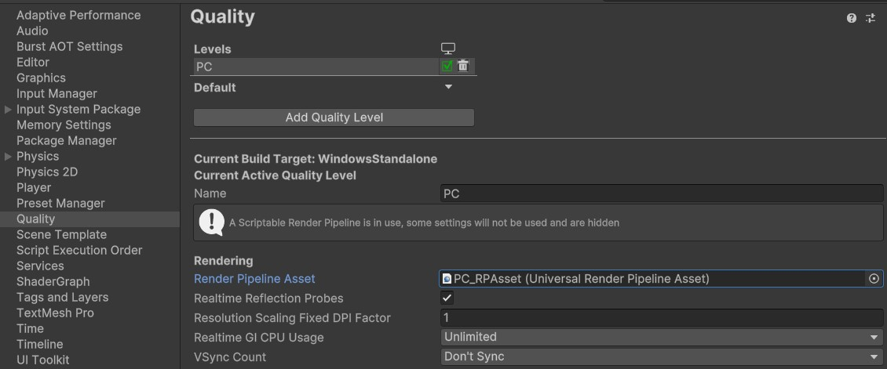
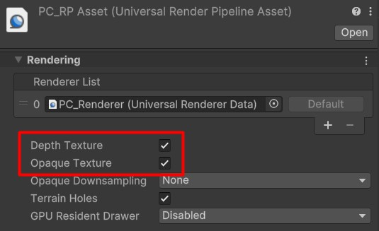
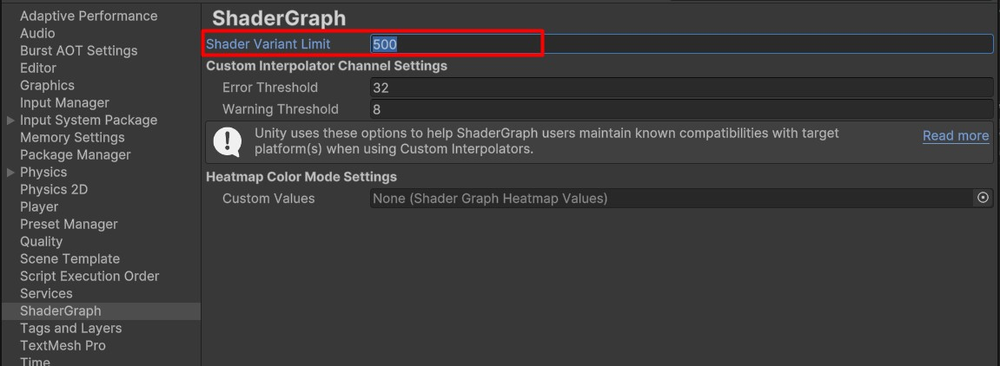
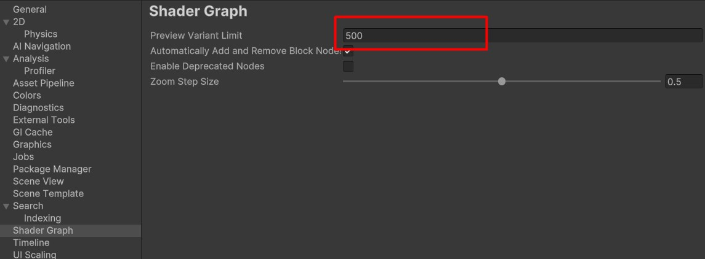

# Water Shader for Unity URP - Getting Started

---

## Recommended Unity Version

- **Unity Version**: 6000.0.30f (or later)
- **Renderer**: Universal Render Pipeline (URP) **only**
- **Shadergraph** 17.0.3 (or later)

---

## Prerequisites

To use the default prebuilt water system you need two things:

1. **URP must be active.** Open **Project Settings** and make sure the **Graphics** and **Quality** sections use a **Universal Render Pipeline Asset**.
   
   
2. **Depth Texture must be enabled** (and **Opaque Texture** if you use Refraction). Without it the water can be **completely invisible**. See [Required URP Settings](usage-guide/getting-started?id=required-urp-settings) below.

> [!NOTE]
> **Prebuilt Compiled Shader is the Default:**  
> The default shader used by the presets, template materials, and demo scene is the prebuilt compiled shader (`Assets/Shaders/Uber Stylized Water/Shader/UberStylizedWater.shader`). It works without any Shader Graph variant limit changes. You only need the URP settings above.

---

## Import the asset

There are two ways to import the asset:

1. Download the repository as a zip file.
   - Copy the `Assets/Shaders/Uber Stylized Water/` folder to your project.

2. Get the latest unity package from the [releases](https://github.com/MatrixRex/Uber-Stylized-Water/releases) page.
   - Import the package.

## Required URP Settings

The water reads the scene behind it, so URP has to provide two textures:

| Setting | Required? | Used for | If it's off |
|---|---|---|---|
| **Depth Texture** | **Always** | Shallow/deep color, Shore Fade, Intersection Foam, Shoreline, Underwater Layer, Caustics | The water can be **completely invisible**. If it does show, it looks like one flat color, with no foam or fade where it touches objects or the shore. |
| **Opaque Texture** | Only for **Refraction** | Refraction | Refraction doesn't show the scene under the water. |

!> These options are on the **URP Asset** (Universal Render Pipeline Asset), **not** on the Universal Renderer Data asset. They're two different assets.

### Option A: Enable them on your URP Asset

1. **Find the URP Asset in use.** Go to **Project Settings > Quality**, select a quality level, and look at its **Render Pipeline Asset** field. If it's empty, the asset under **Project Settings > Graphics > Default Render Pipeline** is used.
2. **Select that asset** in the Project window.
3. In the Inspector, open the **Rendering** section and check:
   - **Depth Texture**
   - **Opaque Texture** (only needed for Refraction)

> **Every quality level can use a different URP Asset.** The default URP template, for example, ships with separate *PC* and *Mobile* assets. Enable the textures on **every URP Asset your project uses**, or the water will break on some platforms or quality levels.

### Option B: Use the included URP Asset

Assign `Demo/Settings/UWa_RPAsset` in **Project Settings > Graphics** and **Quality**. It already has both textures enabled. This replaces your project's pipeline settings, so only do this if you aren't using your own URP Asset.

### Check your cameras

Cameras can override these settings. Select your camera and open **Rendering**:
- **Depth Texture** and **Opaque Texture** should be **Use Pipeline Settings** (the default) or **On**.
- If either is **Off**, that camera won't render the water correctly even when the URP Asset is set up.

### Built-in warning

The water material's Inspector shows a warning when the **active** URP Asset has Depth Texture off, or has Opaque Texture off while Refraction is enabled. Click **Enable** to turn it on. This fixes only the currently active asset, so still check your other quality levels and your cameras.

> **Tip:** For sharper refraction, set **Opaque Downsampling** (under Opaque Texture on the URP Asset) to **None**. The default 2x Bilinear gives a slightly blurry result.

---

## Demo Scene

Get started quickly with the provided **Demo Scene**:

1. Open the `Uber Stylized Water/Demo/Uber Stylized Water.unity` scene.
2. Explore a fully set up environment featuring:
   - **8 Water Presets** (using the prebuilt compiled shader)
   - A complete **Planar Reflection Setup**
3. Press **Play** and use the buttons at the bottom of the screen to switch between the water presets. The layout adapts to desktop and mobile portrait screens.

> The switcher is the `WaterPresetSwitcher` component on the **Water Preset UI** object. It lists every child of the **Water Templates** object, so a preset you add there gets its own button automatically.

---

## Adding the Shader to Your Own Scene

There are three methods to use the shader in your custom scenes:

### Method 1: Use Template Prefabs

- Drag and drop water prefabs from the `Prefabs/Water Templates` folder into your scene.

### Method 2: Apply Preset Materials

- Select any water preset material from the `Uber Stylized Water/Template Materials` folder.
- Assign it to your existing meshes.

### Method 3: Create Your Own Material

- Create a new Material in Unity.
- Assign the **Uber Stylized Water** shader to your material. This uses the default prebuilt compiled shader.

> **Tip:** The **Wave** feature moves the mesh vertices, so it needs a sufficiently subdivided mesh to look smooth. On a low-poly plane (like Unity's default Plane or Quad) the waves will look blocky or barely move.

---

## Advanced: Modifying the Source Shader Graph

If you want to customize or modify the water shader internals, you must use the source Shader Graph:
- Locate the graph at `Assets/Shaders/Uber Stylized Water/Shader/Devlopment/UberStylizedWaterGraph.shadergraph`.
- Before opening or saving this graph, you **must** increase the shader variant limits in both your project settings and editor preferences to prevent compilation timeouts or cut-offs:

### 1. Adjusting Variant Limits in Project Settings:
- Under **Project Settings -> Shadergraph**:
  - Increase the 'Shader variant limit' to **25000** (all Unity versions).
  

### 2. Adjusting Preview Variant Limits in Preferences:
- Under **Preferences -> ShaderGraph**:
  - Increase the 'Preview variant limit' to **25000** (all Unity versions).
  

---

## Next step

- Tweak the material properties in [Shader Properties](usage-guide/shader-properties/shader-properties.md)

## Additional Components

- [Planar Reflection Setup Guide](usage-guide/Additional-Components/planner-reflection-setup.md)

---
