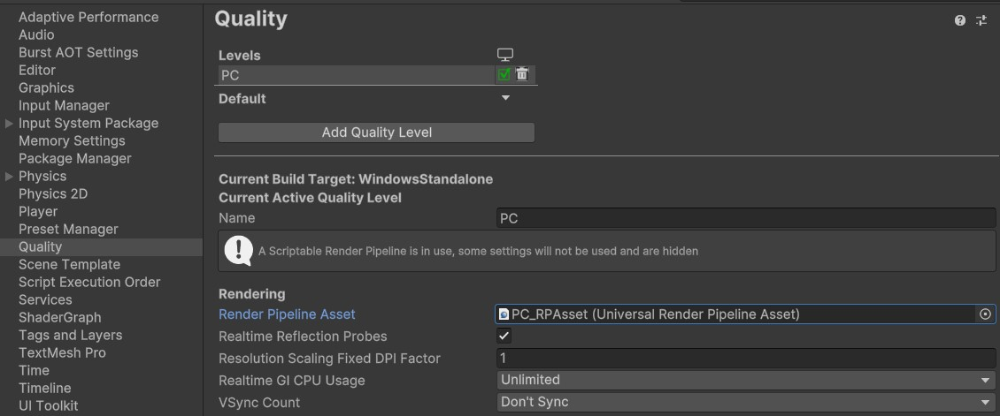
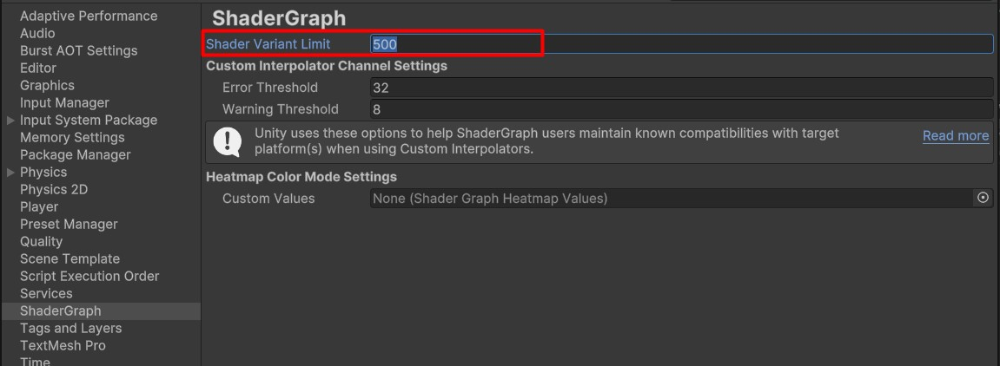
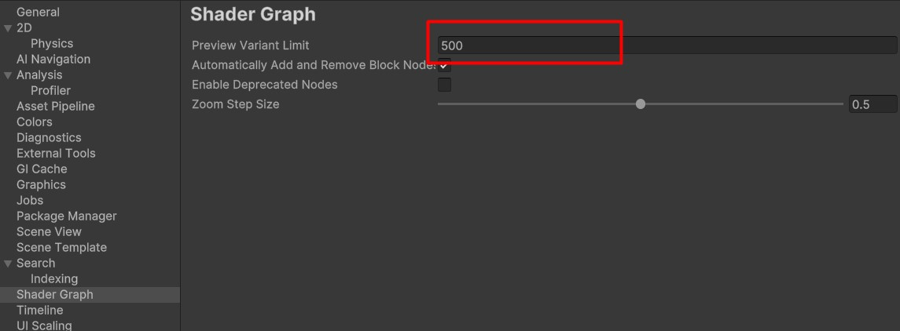
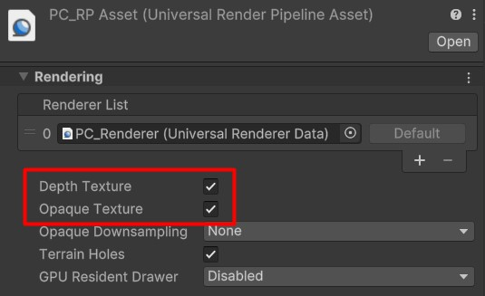

# Water Shader for Unity URP - Getting Started

---

## Recommended Unity Version

- **Unity Version**: 6000.0.30f (or later)
- **Renderer**: Universal Render Pipeline (URP) **only**
- **Shadergraph** 17.0.3 (or later)

---

## Prerequisites

### 1. Project Settings Setup

- Open the **Project Settings** and ensure that the **Graphics** and **Quality** section is set to **Universal Render Pipeline Asset**
  
  
- On the **Shadergraph** section, increase the 'Shader variant limit' to 500.

  

### 2. Preferences Setup

- On the **Preferences**, under the **ShaderGraph** section, increase the 'Preview variant limit' to 500.

  

## Import the asset

There are two ways to import the asset:

1.  Download the reposetory as a zip file.

    - Copy the `Assets/Shaders/Uber Stylized Water/ folder` to your project.

2.  Get the unity package from release page.
    - Import the package.

### Configure the URP Asset

Use the pre-configured Renderer Asset included in the `Demo/Settings` folder.

Or Modify your URP Renderer Asset to support the shader:

1. Open your Renderer Asset.
2. Check the **Depth Texture** option.
3. Check the **Opaque Texture** option.(Required for Refraction)

---

## Demo Scene

Get started quickly with the provided **Demo Scene**:

1. Open the `Uber Stylized Water/Demo/Uber Stylized Water.unity` scene.
2. Explore a fully set up environment featuring:
   - **8 Water Presets**
   - A complete **Planar Reflection Setup**

---

## Adding the Shader to Your Own Scene

There are three ways to use the shader in your custom scenes:

### 1. Use Template Prefabs

- Drag and drop water prefabs from the `Prefabs/Water Templates` folder into your scene.

### 2. Apply Preset Materials

- Select any water preset material from the `Uber Stylized Water/Template Materials` folder.
- Assign it to your existing meshes.

### 3. Create Your Own Material

- Create a new Material in Unity.
- Assign the **UberStylizedWater** shader to your material.

---

## Next step

- Tweak the material properties in [Shader Properties](usage-guide/shader-properties/shader-properties.md)

## Additional Components

- [Planar Reflection Setup Guide](planarreflection.md)

---
