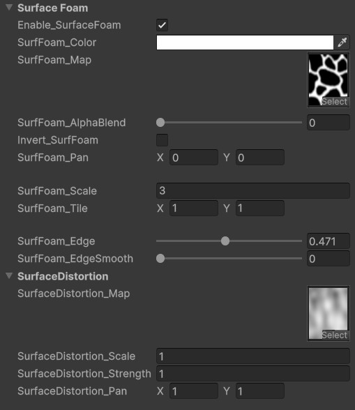
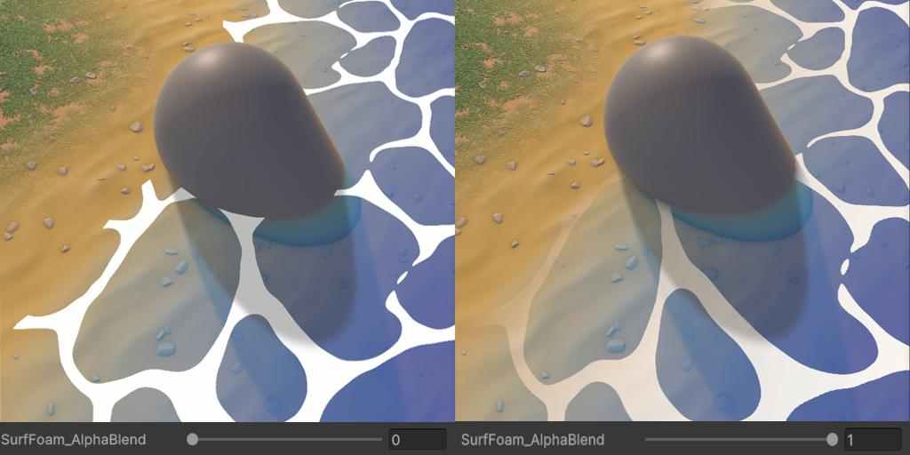

# Surface Foam and Distortion Settings

This effect creates a moving foam effect on the water surface.

<video autoplay loop src="../../assets/images/shader-prop-surffoam-show.mp4" title="Title"></video>

## Unique Parameters

### 1. Surface Foam

- A texture is required in the `SurfFoam_Map` slot for this effect to work.
- `SurfFoam_AlphaBlend` controls wheather the alpha should blend with water alpha or not.

  

#### Edge Smoothing:

Using a blurry foam map, we can control the thickness of the foam using this settings.

- **SurfFoam_Edge**: Controls the thickness of the foam edges.
- **SurfFoam_EdgeSmooth**: Controls the edge smoothness. A subtle value will help to minimize jagged edges.

<video controls src="../../assets/images/shader-prop-surffoam-edge.mp4" title="Title"></video>

### 2. Surface Distortion

- A texture is required in the `SurfaceDistortion_Map` slot for this effect to work.
- This texture is used to distort the surface foam, adding extra motion to the water surface.

<video controls src="../../assets/images/shader-prop-surffoam-distortion.mp4" title="Title"></video>

---
