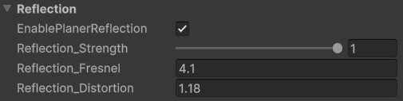

# Reflection Settings

This shader supports **Planar Reflection** and **Reflection Probes** to simulate reflections on the water surface.

<video autoplay loop src="../../assets/images/shader-prop-reflection-show.mp4" title="Title"></video>

- **Planar Reflection**:  
   Requires proper setup to function correctly. Refer to the [Planar Reflection Setup Guide](usage-guide/Additional-Components/planner-reflection-setup.md) for instructions.

  <video autoplay loop src="../../assets/images/shader-prop-reflection-compare.mp4" title="Title"></video>

---

## Unique Parameters

### **Reflection Strength**

- **`Reflection_Strength`**:  
  Controls the opacity of the reflection. Higher values make the reflection more prominent.

---

### **Fresnel Effect**

Reflections are blended using a **Fresnel effect** for realism:

- Looking **directly down** at the water reduces reflection visibility.
- Reflections are **more visible at glancing angles**.

- **`Reflection_Fresnel`**:  
  Controls the Fresnel angle.
  - Higher values make reflections **less visible** when viewed directly from above.
  - Lower values enhance the reflection's prominence across all angles.

<video controls src="../../assets/images/shader-prop-reflection-fresnel.mp4" title="Title"></video>

### **Reflection Distortion**

- **`Reflection_Distortion`**:  
  Adjusts how much the **[Normal Map](usage-guide/shader-properties/shader-prop-normal.md)** distorts the reflection.
  - Higher values create rippled, wavy distortions, simulating rough water.
  - Lower values create smoother, more stable reflections, ideal for calm water.

---
