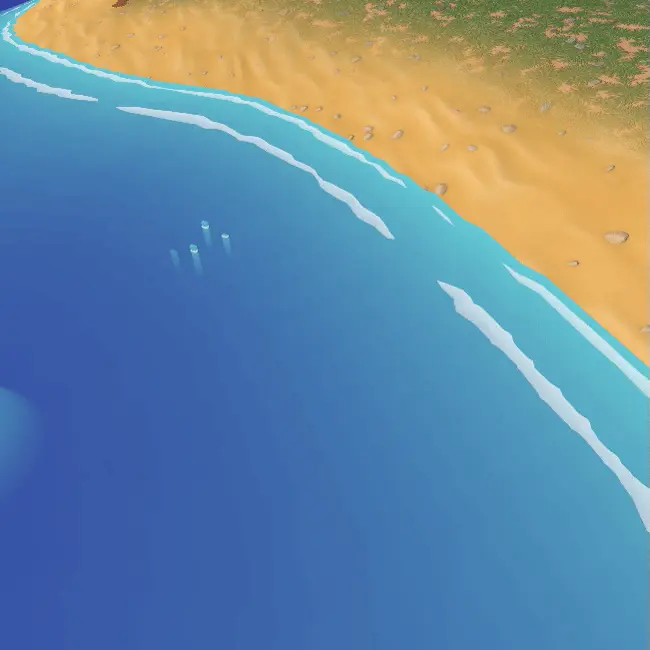

# Shoreline Settings

The **Shoreline Effect** creates animated foam that moves either towards or away from the shore.

---

## Unique Parameters

### **Foam Behavior**

- **`SL_Speed`**:  
  Controls the speed at which the foam moves.
- **`SL_Density`**:  
  Sets the density of shoreline foam lines.
- **`SL_Thickness`**:  
  Adjusts the thickness of the foam lines for a more pronounced or subtle effect.

---

### **Center Mask**

- **`SL_CenterMask`**:  
  Masks the shoreline foam from the center of the water, controlling how far the foam appears from the shore.
- **`SL_CenterMaskFade`**:  
  Adjusts the smoothness of the transition in the center masked region.

---

### **Dissolve Effect**

- **`SL_Dissolve`**:  
  Enables the dissolve effect for shoreline foam. Requires a dissolve mask to function.
- **`SL_Dissolve_Mask`**:  
  Specifies the texture to be used as the dissolve mask.
- **`SL_Dissolve_ShoreGradient`**:  
  contols the dissolve distribution. When,

  value = `0`, the foam is evenly Dissolved

  value = `1`, the foam dissolve more towards water center and less towards shore. This feels like the shoreline is gradually widening near shore.

  value = `-1`, the foam dissolve more towards shore and less towards water center. This feels like the shoreline is gradually Shrinking near shore.

---

### **Trailing Effect**

- **`SL_EnableTrail`**:  
  Toggles the trailing effect for foam lines, creating a flowing motion behind them.
- **`SL_Trail_Fade`**:  
  Controls the fade strength of the trailing effect for smoother transitions.

---
